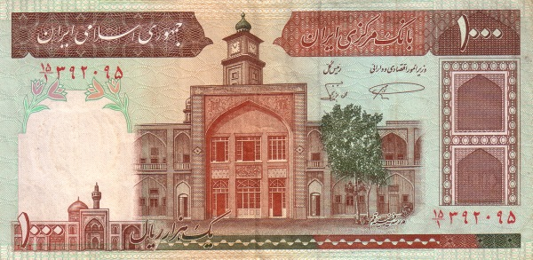

# ریال جدید

  

این ریپازیتوری شامل پیاده‌سازی‌های ساده و چندزبانه برای تبدیل ریال قدیم به ریال جدید است.
طبق مصوبه‌ی بانک مرکزی ایران، واحد پولی کشور از ریال به تومان (یا ریال جدید معادل تقسیم بر ۱۰۰۰) تغییر خواهد کرد. هدف این پروژه ارائه‌ی ابزار و نمونه‌کد در زبان‌های مختلف برنامه‌نویسی برای تسهیل این تبدیل است.

## چرا این پروژه؟

یکپارچه‌سازی تبدیل ریال به ریال جدید در سیستم‌ها و نرم‌افزارهای مختلف
کاهش خطاهای انسانی در محاسبات مالی
آماده‌سازی برای تغییرات رسمی واحد پولی کشور

## نحوه‌ی کار

اصل تبدیل بسیار ساده است:
ریال جدید = ریال قدیم ÷ 1000

برای مثال:

- ۱٬۰۰۰ ریال قدیم → ۱ ریال جدید
- ۵۰٬۰۰۰ ریال قدیم → ۵۰ ریال جدید
- ۱۲۳٬۴۵۶٬۰۰۰ ریال قدیم → ۱۲۳٬۴۵۶ ریال جدید

## زبان‌های پشتیبانی‌شده

در این ریپازیتوری نمونه‌کدهایی برای زبان‌های زیر ارائه می‌شود:
- Python (wip)
- JavaScript
- C / C++ (wip)
- Java (wip)
- Go (wip)
- Rust (wip)
- PHP (wip)
- C# (wip)

و سایر زبان‌های پرکاربرد

## مشارکت

از شما دعوت می‌کنیم با افزودن پیاده‌سازی در زبان‌های دیگر یا بهبود نمونه‌کدها در این پروژه مشارکت کنید.
ریپازیتوری را fork کنید.
تغییرات خود را اضافه کنید.
Pull Request بزنید.

## لایسنس

این پروژه تحت مجوز MIT منتشر شده است. استفاده، تغییر و انتشار آزاد است.
